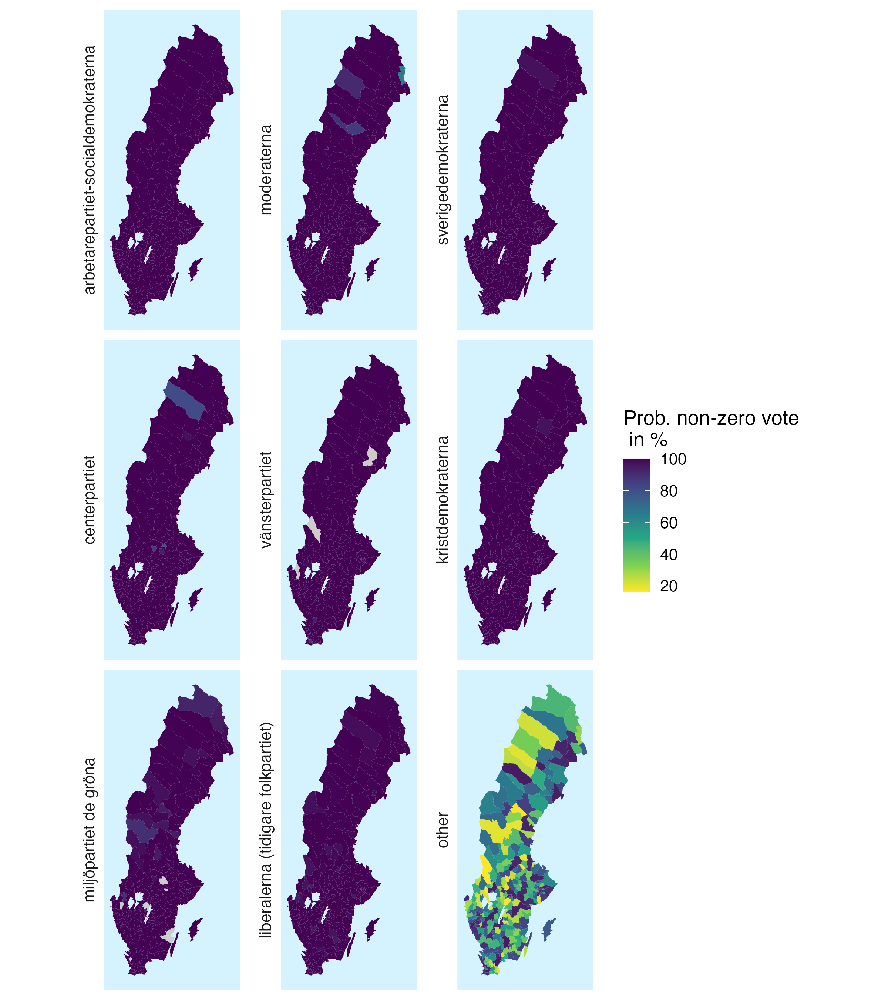
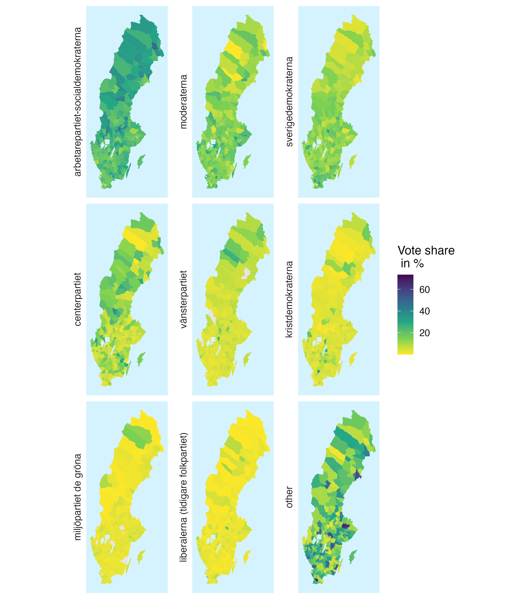
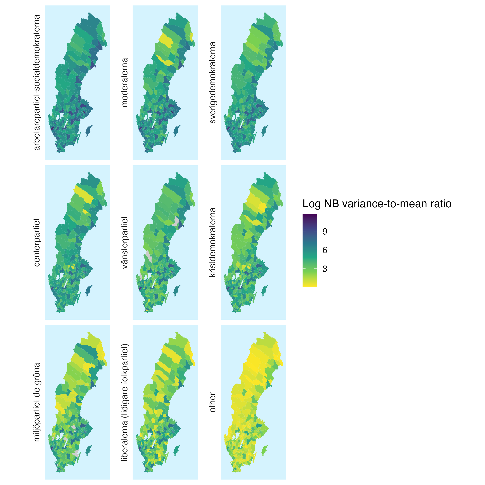

# Overview

This repository contains forecasts for the **2026 Swedish municipal elections** generated before election day using a bounded neural zero-inflated negative binomial (ZINB) forecasting model.

The repository serves two purposes:

1. To provide a publicly archived forecast record prior to the election.
2. To evaluate forecast accuracy after the official election results become available.

The forecasts were generated using historical municipal-election data, candidate-list information, and municipality-level voter composition data obtained from the Swedish Election Authority.

---

# Forecast Release

**Forecast release date:** 31 August 2026

**Election date:** 13 September 2026

No information from the final 2026 election results was used in model development, estimation, tuning, or forecasting.

This repository constitutes the public pre-election forecast record.

---

# Main Results

## National Forecast

| Party | Predicted Vote Share |
|---------|---------:|
| Social Democrats | 29.23% |
| Moderates | 21.44% |
| Sweden Democrats | 13.67% |
| Centre Party | 8.27% |
| Left Party | 7.63% |
| Christian Democrats | 5.53% |
| Green Party | 5.33% |
| Liberals | 4.27% |

See:

```text
forecasts/github_forecast_kommun_val_2026_agg_party.csv
```

---

## Municipality-Level Forecasts

Municipality-level forecasts are available in:

```text
forecasts/github_forecast_kommun_val_2026.csv
```

Each row corresponds to a party–municipality combination and includes:

- municipality identifier
- municipality name
- party
- predicted vote count
- predicted vote share
- probability of electoral presence
- uncertainty measures

---

# Forecast Maps

## Predicted Electoral Presence



The maps display the predicted probability that a party belongs to the count-generating process rather than the structural-zero state.

---


## Predicted Vote Shares



The maps display the predicted party vote share.

---

## Forecast Uncertainty


maps display the logarithmic variance-to-mean ratio implied by the fitted negative-binomial model.

---

# Methodology

The forecasting framework is a bounded neural zero-inflated negative binomial model designed for local multiparty elections.

The model combines:

- zero-inflation for excess zeros;
- negative-binomial count modeling for over-dispersion;
- party embeddings;
- municipality embeddings;
- party–municipality interaction embeddings;
- municipality-specific dispersion parameters;
- elastic-net shrinkage gates.

The expected vote count is modeled as


$\mu_i= N_i \cdot \sigma(\eta_i),$


where \(N_i\) is the number of eligible voters and \(\sigma(\cdot)\) is the sigmoid function.

This guarantees that expected votes for a party cannot exceed the size of the eligible electorate.

---

# Data

## Historical Elections

Historical data cover the municipal elections of:

- 2014
- 2018
- 2022

Data were obtained from the Swedish Election Authority.

## Forecast Inputs

Forecast-period inputs include:

- participating parties in 2026;
- registered candidates in 2026;
- municipality-level eligible-voter counts for 2026.

At the time of forecast generation, detailed 2026 electorate-composition statistics were not yet available. Municipality-level electorate characteristics were therefore carried forward from the corresponding 2022 measurements.


---

# Repository Structure

```text
forecasts/
│
├── forecast_2026_party_kommun.csv
├── forecast_2026_party_kommun_agg_party.csv
├── forecast_2026_party_kommun_agg_party_history.csv
│
figures/
│
├── forecast_map.png
├── forecast_map_prob_vote.png
├── forecast_map_mu.png
├── forecast_map_var_mu.png
├── forecast_map_win_party.png
│
input_data/
│
├── all_year_clean.csv
│
code/
│
├── functions
├── train_infer
├── post_analysis
```

---

# Reproducibility

The code is written in R and relies primarily on:

- data.table
- sf
- keras
- tensorflow
- ggplot2

A typical workflow is:

```r
source("code/functions_zinb_gate_2_prune.R")
source("zinb_gate_2_prune_train_infer.R")
source("zinb_gate_2_prune_post.R")
```

---

# Election Evaluation

After official election results become available, this repository will be updated with:

- realized election outcomes;
- forecast errors;
- calibration plots;
- municipality-level comparisons;
- national-level comparisons.

Planned output files include:

```text
results/forecast_vs_actual.csv
results/forecast_accuracy_summary.csv
figures/forecast_accuracy.png
```

---

# Scientific Contribution

This project demonstrates how modern machine-learning methods can be integrated with probabilistic count-data models to forecast multiparty local elections.

Beyond point forecasts, the framework provides:

- probability of electoral presence;
- expected vote counts;
- predicted vote shares;
- municipality-specific forecast uncertainty.

---

# Citation

If you use these forecasts, please cite:

```text
Qi, Haodong & Iacus, M. Stefano (2026).

Forecasting the 2026 Swedish Municipal Elections:
A Bounded Neural Zero-Inflated Count Model.

GitHub repository:
https://github.com/HaodongQi/voting_swe_2026
```

---

# License

MIT License

---

# Contact

Haodong Qi

GitHub: https://github.com/HaodongQi